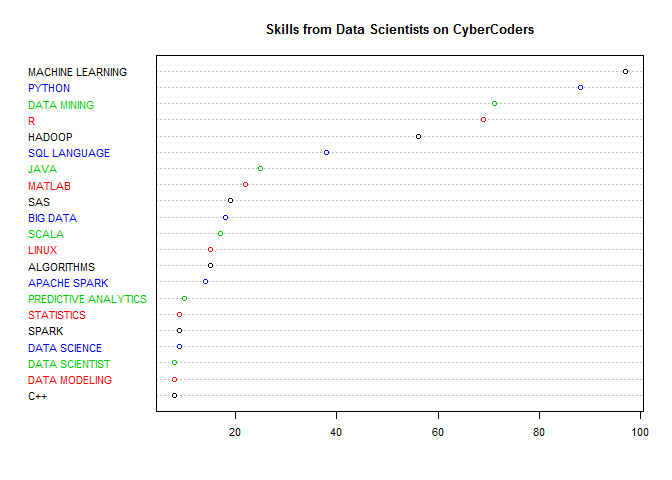
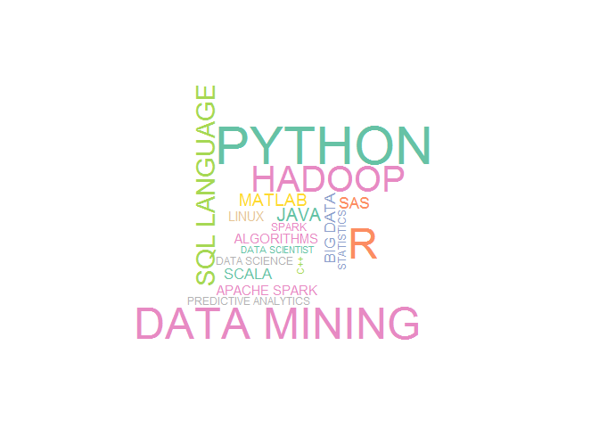

# case study 2
Gunes Alkan  
November 7, 2015  

 A recently emerged field, Data Science, still does not have solid borders, and there are a lot of different perspectives and lack of clarity on the topic. One way to understand what is typically expected from a Data Scientist is to scrape / harvest a job website, and examine what skill set companies are looking for. Here, we will work on the job descriptions collected from the website called "CyberCoders", and R will be used as the software package. We will, first, define our own functions to make sure that the case study is reproducible at any time by anybody, so that a broad function will use the small functions defined, and will require only the name of job (in this case it will be: Data Scientist). Here, salary range, and location of job can also be found, but we will rather be interested in skill sets. Finally, after scraping all Data Science job posts on CyberCoders, we'll visualize the results to make the conclusion more understandable.


```r
#Required packages
library(XML)
library(bitops)
library(RCurl)
library(RColorBrewer)
library(wordcloud)
```


```r
# We first set variable StopWords
StopWords = readLines("http://jmlr.csail.mit.edu/papers/volume5/lewis04a/a11-smart-stop-list/english.stop")

###
#and use them in a user defined function in order to use our own function to remove stopwords in the next step
asWords = function(txt, stopWords = StopWords, stem = FALSE)
{
  words = unlist(strsplit(txt, '[[:space:]!.,;#:()/"]+'))
  words = words[words != ""]
  if(stem && require(Rlibstemmer))
     words = wordStem(words)
  i = tolower(words) %in% tolower(stopWords)
  words[!i]
}

###
# here we define a function to remove stopwords from the text we want
removeStopWords = function(x, stopWords = StopWords) 
     {
         if(is.character(x))
             setdiff(x, stopWords)
         else if(is.list(x))
             lapply(x, removeStopWords, stopWords)
         else
             x
     }
### 

cy.getFreeFormWords = function(doc, stopWords = StopWords)
     {
         nodes = getNodeSet(doc, "//div[@class='job-details']/
                                 div[@data-section]")
         if(length(nodes) == 0) 
             nodes = getNodeSet(doc, "//div[@class='job-details']//p")
         
         if(length(nodes) == 0) 
             warning("did not find any nodes for the free form text in ",
                     docName(doc))
         
         words = lapply(nodes,
                        function(x)
                            strsplit(xmlValue(x), 
                                     "[[:space:][:punct:]]+"))
         
         removeStopWords(words, stopWords)
     }
```

This fetches the lists of free-form text in the HTML document and then decomposes the text into the words in each element, using spaces and punctuation characters to separate them.

Question 1: Implement the following two functions. Use the code we explored to extract the skill sets and salary and location information from the parsed HTML document.


```r
cy.getSkillList = function(doc)
{
  lis = getNodeSet(doc, "//div[@class = 'skills-section']//
                         li[@class = 'skill-item']//
                         span[@class = 'skill-name']")

  sapply(lis, xmlValue)
}


cy.getDatePosted = function(doc)
  { xmlValue(getNodeSet(doc, 
                     "//div[@class = 'job-details']//
                        div[@class='posted']/
                        span/following-sibling::text()")[[1]],
    trim = TRUE) 
}

cy.getLocationSalary = function(doc)
{
  ans = xpathSApply(doc, "//div[@class = 'job-info-main'][1]/div", xmlValue)
  names(ans) = c("location", "salary")
  ans
}

# cy.getSkillList(cydoc)
# cy.getLocationSalary(cydoc)

# The function `cy.ReadPost()` given below reads each job post. 
# This function implements three other functions: `cy.getFreeFormWords()`, `cy.getSkillList()`, and `cy.getLocationSalary()`

cy.readPost = function(u, stopWords = StopWords, doc = htmlParse(u))
  {
    ans = list(words = cy.getFreeFormWords(doc, stopWords),
         datePosted = cy.getDatePosted(doc),
         skills = cy.getSkillList(doc))
    o = cy.getLocationSalary(doc)
    ans[names(o)] = o
    ans
}

### Reading posts programmatically

# Obtain URLs for job posts
txt = getForm("http://www.cybercoders.com/search/", searchterms = '"Data Scientist"',
              searchlocation = "",  newsearch = "true", sorttype = "")

# Parse the links
doc = htmlParse(txt, asText = TRUE)
links = getNodeSet(doc, "//div[@class = 'job-title']/a/@href")

# Save the links in the vector joblinks
joblinks <- getRelativeURL(as.character(links), "http://www.cybercoders.com/search/")

# Read the posts
posts <- lapply(joblinks,cy.readPost)

###

cy.getPostLinks = function(doc, baseURL = "http://www.cybercoders.com/search/") 
  {
    if(is.character(doc)) doc = htmlParse(doc)
    links = getNodeSet(doc, "//div[@class = 'job-title']/a/@href") 
    getRelativeURL(as.character(links), baseURL)
}

cy.readPagePosts = function(doc, links = cy.getPostLinks(doc, baseURL),
baseURL = "http://www.cybercoders.com/search/")
  {
    if(is.character(doc)) doc = htmlParse(doc)
    lapply(links, cy.readPost)
 }
```


```r
## Testing the function with the parsed version of the first page of results in object doc
posts = cy.readPagePosts(doc)
sapply(posts,`[[`, "salary")
```

```
##           /data-scientist-job-202521           /data-scientist-job-214172 
##            "Full-time $120k - $200k"            "Full-time $100k - $160k" 
##           /data-scientist-job-200988           /data-scientist-job-184567 
##            "Full-time $100k - $160k"            "Full-time $130k - $160k" 
##           /data-scientist-job-230442           /data-scientist-job-234161 
##            "Full-time $140k - $160k" "Full-time Compensation Unspecified" 
##           /data-scientist-job-223862           /data-scientist-job-230135 
## "Full-time Compensation Unspecified" "Full-time Compensation Unspecified" 
##           /data-scientist-job-231278           /data-scientist-job-235549 
##             "Full-time $50k - $110k"            "Full-time $120k - $150k" 
##           /data-scientist-job-232102           /data-scientist-job-223543 
##            "Full-time $100k - $160k"            "Full-time $100k - $150k" 
##           /data-scientist-job-193909           /data-scientist-job-199692 
##            "Full-time $110k - $150k" "Full-time Compensation Unspecified" 
##           /data-scientist-job-221652           /data-scientist-job-224228 
##             "Full-time $75k - $150k"            "Full-time $100k - $150k" 
##           /data-scientist-job-227142           /data-scientist-job-227433 
##            "Full-time $100k - $130k"             "Full-time $75k - $100k" 
##           /data-scientist-job-227439           /data-scientist-job-227443 
##            "Full-time $120k - $140k"             "Full-time $90k - $110k"
```

```r
summary(sapply(posts, function(x) length(unlist(x$words))))
```

```
##    Min. 1st Qu.  Median    Mean 3rd Qu.    Max. 
##    66.0    99.0   126.5   141.1   166.5   326.0
```

The following code chunk pulls it all together. The function `cy.getNextPageLink()` retrieves each page from CyberCoders and calls the other functions to parse each post in order to obtain information such as salary, skills, and location.


```r
# Test of concept
# getNodeSet(doc, "//a[@rel='next']/@href")[[1]]
## A function to get all pages
cy.getNextPageLink = function(doc, baseURL = docName(doc))
{
  if(is.na(baseURL))
     baseURL = "http://www.cybercoders.com/"
  link = getNodeSet(doc, "//li[@class = 'lnk-next pager-item ']/a/@href")
  if(length(link) == 0)
    return(character())
    link2 <- gsub("./", "search/",link[[1]])
 getRelativeURL(link2, baseURL)
}

# Test the above function
tmp = cy.getNextPageLink(doc, "http://www.cybercoders.com")
```

Now we have all we need to retrieve all job posts on Cyber Coders for a given search query.
The following function puts it all together into a function that we can call with a search string for a job of interest. 
The function submits the initial query and then reads the posts from each result page.


```r
cyberCoders =
function(query)
{
   txt = getForm("http://www.cybercoders.com/search/",
                  searchterms = query,  searchlocation = "",
                  newsearch = "true",  sorttype = "")
   doc = htmlParse(txt)

   posts = list()
   while(TRUE) {
       posts = c(posts, cy.readPagePosts(doc))
       nextPage = cy.getNextPageLink(doc)
       if(length(nextPage) == 0)
          break

       nextPage = getURLContent(nextPage)
       doc = htmlParse(nextPage, asText = TRUE)
   }
   invisible(posts)
}
```

 The function cyberCoders is called below with the skill "Data Scientist". 
 Then, we sort the skills and obtain all skills that are mentioned more than twice in the list.


```r
dataSciPosts = cyberCoders("Data Scientist")
tt = sort(table(unlist(lapply(dataSciPosts, `[[`, "skills"))),
           decreasing = TRUE)
tt[tt >= 2]
```

```
## 
##                              Machine Learning 
##                                            97 
##                                        Python 
##                                            88 
##                                   Data Mining 
##                                            71 
##                                             R 
##                                            69 
##                                        Hadoop 
##                                            56 
##                                           SQL 
##                                            38 
##                                          Java 
##                                            25 
##                                        Matlab 
##                                            22 
##                                           SAS 
##                                            19 
##                                      Big Data 
##                                            18 
##                                         Scala 
##                                            17 
##                                    Algorithms 
##                                            15 
##                                         Linux 
##                                            15 
##                                  Apache Spark 
##                                            14 
##                          Predictive Analytics 
##                                            10 
##                                  Data Science 
##                                             9 
##                                         SPARK 
##                                             9 
##                                    Statistics 
##                                             9 
##                                           C++ 
##                                             8 
##                                 Data Modeling 
##                                             8 
##                                Data Scientist 
##                                             8 
##                                     Mapreduce 
##                                             7 
##                                         NoSQL 
##                                             7 
##                          Statistical Analysis 
##                                             7 
##                          Statistical Modeling 
##                                             7 
##                                           AWS 
##                                             6 
##                            Big Data analytics 
##                                             6 
##                                 Data Analysis 
##                                             6 
##                   Natural Language Processing 
##                                             6 
##                           Predictive Modeling 
##                                             6 
##                                 Deep Learning 
##                                             5 
##                                         C/C++ 
##                                             4 
##                            Data Visualization 
##                                             4 
##                                          Hive 
##                                             4 
##                                       Tableau 
##                                             4 
##                         Algorithm Development 
##                                             3 
##                           Applied Mathematics 
##                                             3 
##                            Bayesian Inference 
##                                             3 
##                           Big Data Statistics 
##                                             3 
##                               Computer Vision 
##                                             3 
##                                 elasticsearch 
##                                             3 
##                                         Excel 
##                                             3 
##                                           Git 
##                                             3 
##                                          HDFS 
##                                             3 
##                   Machine Learning algorithms 
##                                             3 
##                            Mobile Advertising 
##                                             3 
##                                         MySQL 
##                                             3 
##                                           NLP 
##                                             3 
##                                Pandas & NumPy 
##                                             3 
##                                 R programming 
##                                             3 
##                                          SPSS 
##                                             3 
##                                         Agile 
##                                             2 
##                                            AI 
##                                             2 
##                            Applied statistics 
##                                             2 
##                                Bioinformatics 
##                                             2 
##                                 Clinical Data 
##                                             2 
##                 Complex Quantitative Analysis 
##                                             2 
##               Consumer Segmentation Reporting 
##                                             2 
##                            Context Extraction 
##                                             2 
##                                Data Analytics 
##                                             2 
##                                     data sets 
##                                             2 
##                               data structures 
##                                             2 
##                              Data Warehousing 
##                                             2 
##                                           ETL 
##                                             2 
##                   Excel Pivot Tables & Macros 
##                                             2 
## Exp with Click stream data(raw web analytics) 
##                                             2 
##                           Experimental Design 
##                                             2 
##                           Geo-Spatial Analyst 
##                                             2 
##                Healthcare/biomedical industry 
##                                             2 
##                                        HiveQL 
##                                             2 
##                               Large Data Sets 
##                                             2 
##                                        Mahout 
##                                             2 
##                                    Map/Reduce 
##                                             2 
##                                       mongodb 
##                                             2 
##                                           OOP 
##                                             2 
##                                          Perl 
##                                             2 
##                                           PHP 
##                                             2 
##                                    PostgreSQL 
##                                             2 
##                           Predictive Analysis 
##                                             2 
##                         Predictive Analystics 
##                                             2 
##                    Product Analyst experience 
##                                             2 
##                                   Programming 
##                                             2 
##                                      Python/R 
##                                             2 
##                                      R/Python 
##                                             2 
##                        Recommendation Engines 
##                                             2 
##                           Regression analysis 
##                                             2 
##                                      SAS/SPSS 
##                                             2 
##                                  scikit.learn 
##                                             2 
##                                     Scripting 
##                                             2 
##                  SQL and Relational Databases 
##                                             2 
##                                    SQL Server 
##                                             2 
##                            StartUp Experience 
##                                             2 
##                           Statistical Methods 
##                                             2 
##                        statistical techniques 
##                                             2 
##                    Strong Econometric mindset 
##                                             2 
##                Strong Math/Physics background 
##                                             2 
##                                          Unix 
##                                             2 
##                                    Unix/Linux 
##                                             2 
##                                           VBA 
##                                             2 
##                          Virtual Environments 
##                                             2
```

The search term "Data Scientist" returned 146 results on CyberCoders this time. We should remember that the results we get from web scraping are not random, so it is very hard to make inferences to larger populations. 

Now, let's organize data to be able to get meaningful results:


```r
#tt2 is a training set, which is a copy of tt:
tt2 <- tt
names(tt2) <- toupper(names(tt2)) 
head(tt2)
```

```
## MACHINE LEARNING           PYTHON      DATA MINING                R 
##               97               88               71               69 
##           HADOOP              SQL 
##               56               38
```

```r
length(tt2)
```

```
## [1] 303
```

 Now let's combine some similar words / word groups to get a more accurate skill set:


```r
## Combining similar words as groups
# First, the names start with STATIST
grep("+STATIST+", x=names(tt2)) # points outs where those names are
```

```
##  [1]  18  24  25  39  54  93  94 282 283 284 285 286 288 293
```

```r
#see what words including "Statist" are used
tt2[18]
```

```
## STATISTICS 
##          9
```

```r
tt2[24]
```

```
## STATISTICAL ANALYSIS 
##                    7
```

```r
tt2[25]
```

```
## STATISTICAL MODELING 
##                    7
```

```r
tt2[39]
```

```
## BIG DATA STATISTICS 
##                   3
```

```r
tt2[54]
```

```
## APPLIED STATISTICS 
##                  2
```

```r
tt2[93]
```

```
## STATISTICAL METHODS 
##                   2
```

```r
tt2[94]
```

```
## STATISTICAL TECHNIQUES 
##                      2
```

```r
tt2[285]
```

```
## STATISTICS / BUSINESS INTELLIGENCE (SAS/SPSS) 
##                                             1
```

```r
tt2[288]
```

```
## STRONG STATISTICS/ ANALYTICS 
##                            1
```

```r
tt2[282]
```

```
## STATISTIC PACKAGING 
##                   1
```

```r
tt2[283]
```

```
## STATISTICAL & DATA ANALYSIS 
##                           1
```

```r
tt2[284]
```

```
## STATISTICAL ANALYSIS WITH R 
##                           1
```

```r
tt2[286]
```

```
## STATISTICS DEGREE 
##                 1
```

```r
tt2[293]
```

```
## THERMAL OR STATISTICAL PHYSICS 
##                              1
```

```r
i = (names(tt2) == "APPLIED STATISTICS")
if (any(i)) names(tt2)[i] = "STATISTICS"
i = (names(tt2) == "STATISTICAL METHODS")
if (any(i)) names(tt2)[i] = "STATISTICS ANALYSIS"
i = (names(tt2) == "STATISTICAL TECHNIQUES")
if (any(i)) names(tt2)[i] = "STATISTICS ANALYSIS"
i = (names(tt2) == "STATISTICAL & DATA ANALYSIS")
if (any(i)) names(tt2)[i] = "STATISTICS ANALYSIS"
i = (names(tt2) == "STRONG STATISTICS/ ANALYTICS")
if (any(i)) names(tt2)[i] = "STATISTICS"

# Now the names including SQL, UNIX, PRE
grep("+SQ+", x=names(tt2))
```

```
##  [1]   6  23  47  78  90  91 166 221 249 258 279
```

```r
# tt2[6]
# tt2[29]
# tt2[45]
# tt2[79]
# tt2[90]
# tt2[91]
# tt2[163]
# tt2[218]
# tt2[246]
# tt2[255]
# tt2[277]
i = (names(tt2) == "SQL")
if (any(i)) names(tt2)[i] = "SQL LANGUAGE"
i = (names(tt2) == "MYSQL")
if (any(i)) names(tt2)[i] = "SQL LANGUAGE"
i = (names(tt2) == "NOSQL")
if (any(i)) names(tt2)[i] = "SQL LANGUAGE"
i = (names(tt2) == "POSTGRESQL")
if (any(i)) names(tt2)[i] = "SQL LANGUAGE"
i = (names(tt2) == "SQL AND RELATIONAL DATABASES")
if (any(i)) names(tt2)[i] = "SQL LANGUAGE"
i = (names(tt2) == "SQL SERVER")
if (any(i)) names(tt2)[i] = "SQL LANGUAGE"
i = (names(tt2) == "EXPERIENCE FORMING COMPLEX SQL QUERIES")
if (any(i)) names(tt2)[i] = "SQL LANGUAGE"
i = (names(tt2) == "SQL QUERIES ")
if (any(i)) names(tt2)[i] = "SQL LANGUAGE"


grep("^UNI+", x=names(tt2))
```

```
## [1]  97  98 297
```

```r
# tt2[97]
# tt2[294]
# tt2[295]
i = (names(tt2) == "UNIX/LINUX")
if (any(i)) names(tt2)[i] = "UNIX"
i = (names(tt2) == "UNIX / LINUX")
if (any(i)) names(tt2)[i] = "UNIX"

grep("^PREDICT+", x=names(tt2))
```

```
## [1]  15  30  79  80 238
```

```r
# tt2[15]
# tt2[30]
# tt2[80]
# tt2[81]
# tt2[235]
i = (names(tt2) == "PREDICTIVE MODELING")
if (any(i)) names(tt2)[i] = "PREDICTIVE ANALYTICS"
i = (names(tt2) == "PREDICTIVE ANALYSIS")
if (any(i)) names(tt2)[i] = "PREDICTIVE ANALYTICS"
i = (names(tt2) == "PREDICTIVE ANALYSTICS")
if (any(i)) names(tt2)[i] = "PREDICTIVE ANALYTICS"
i = (names(tt2) == "PREDICTIVE MODELING AND ANALYTICS")
if (any(i)) names(tt2)[i] = "PREDICTIVE ANALYTICS"

grep("+MATH+", x=names(tt2))
```

```
## [1]  37  96 211
```

```r
i = (names(tt2) == "APPLIED MATHEMATICS")
if (any(i)) names(tt2)[i] = "MATHEMATICS"
i = (names(tt2) == "STRONG MATH/PHYSICS BACKGROUND")
if (any(i)) names(tt2)[i] = "MATHEMATICS"
i = (names(tt2) == "MATHEMATICAL")
if (any(i)) names(tt2)[i] = "MATHEMATICS"

grep("^MACH+", x=names(tt2))
```

```
## [1]   1  45 206 207 208
```

```r
i = (names(tt2) == "MACHINE LEARNING ALGORITHMS")
if (any(i)) names(tt2)[i] = "MACHINE LEARNING"
i = (names(tt2) == "MACHINE LEARNING (A PLUS)")
if (any(i)) names(tt2)[i] = "MACHINE LEARNING"
i = (names(tt2) == "MACHINE LEARNING LIBRARY")
if (any(i)) names(tt2)[i] = "MACHINE LEARNING"
i = (names(tt2) == "MACHINE LEARNING TECHNOLOGIES")
if (any(i)) names(tt2)[i] = "MACHINE LEARNING"
i = (names(tt2) == "MACHINE LEARNING (A PLUS)")
if (any(i)) names(tt2)[i] = "MACHINE LEARNING"
```

 Here, I have combined terms like "Statistical Methods, Statistical/Data Analysis, Statistical Techniques" under the name of "Statistical Analysis", and "Strong Statistics, Applied Statistics and Statistics" under one name: "Statistics".
 Also, skills related to SQL such as NOSQL, MYSQL are combined under the title of "SQL Language". Next, I have merged all similar skill sets related to Predictive Analysis as "Predictive Analytics", and math related skills as "Mathematics".
 Lastly, "Machine Learning Algorithms, Machine Learning Techniques" and similar terms are combined as "Machine Learning" which appeared to be the most commonly expected skill of a Data Scientist on this website.


 We were able to explicitly extract the necessary keywords from CyberCoders. Now, let's visualize our results in order to see which skill sets and technologies are important for different types of Data Science jobs corresponding to our search query:


```r
dotchart(sort(tt2[tt2 > 7]),color=1:4, cex = 0.7, main= "Skills from Data Scientists on CyberCoders")
```

```
## Warning in dotchart(sort(tt2[tt2 > 7]), color = 1:4, cex = 0.7, main =
## "Skills from Data Scientists on CyberCoders"): 'x' is neither a vector nor
## a matrix: using as.numeric(x)
```

 

 Here the words that appeared at least 7 times are plotted. We see that according to the website CyberCoders, skill that is expected most is about Machine Learning, then the programming tool Python and so on. Here, it is clearly showed that R and SAS are one of the most commonly required programming languages by those companies. Also, Statistical Modeling, Statistical Analysis and Statistics itself appeared to be one of the inevitably important skills of a potential data scientist.

 Now, let's create a different display, a wordcloud, to have a diffrenet perpective:


```r
wordcloud(names(tt2), freq=tt2, min.freq = 7, scale=c(4, .4), max.words=20, colors=brewer.pal(8,"Set2"), rot.per=.3 ,random.color=T)
```

```
## Warning in wordcloud(names(tt2), freq = tt2, min.freq = 7, scale = c(4, :
## MACHINE LEARNING could not be fit on page. It will not be plotted.
```

 

 Again, the wordcloud shows that the most commonly expected skill that job describtions on CyberCoders has is Machine Learning (Although we have rescaled our wordcloud, MACHINE LEARNING still might not be fit on page. Therefore, it might not be plotted here.). It can easily be said that Data Mining, Python, Hadoop, SQL are also very important according to the descriptions on this specific website. Since wordcloud and the previous dotplot are plotted using the same data, it shouldn't be surprising to get the same results.


Reference: Code taken from Nolan, D. and Temple Lang. Data Science in R: A Case Studies Approach to Computational Reasoning and Problem Solving. CRC Press, 04/2015. VitalBook file.

